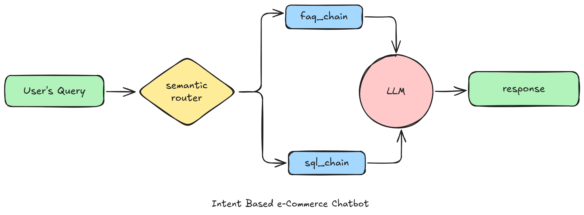

# 🛍️ E-Commerce Chatbot — AI Assistant for Policies & Products

This is a generative AI chatbot designed for e-commerce platforms. It can answer both **general FAQs** (e.g. "What is your refund policy?") and **product-specific queries** (e.g. "Show me PUMA shoes above 30% discount") using a combination of vector search, LLM-based reasoning, and SQL generation.

It uses **Groq's LLama3.3**, **ChromaDB**, and **Streamlit** to deliver fast and accurate responses.

---

## 💡 How It Works

1. **User enters a query** (e.g., “Do you accept debit cards?” or “Top 3 Nike shoes under 3000”)
2. The query is passed through a **semantic router**, which classifies it as either:
   - `faq` → answers are retrieved from a vector DB (ChromaDB)
   - `sql` → the question is translated into an SQL query and run on the product database
3. The appropriate chain (`faq_chain` or `sql_chain`) is called.
4. The result is passed to a **Groq-hosted LLM**, which generates a **conversational response**.

---

## 🖼️ Demo Screenshots

### Chatbot in Action


### Architecture Flow



---

## ⚙️ Getting Started

### 1. Install dependencies

```bash
pip install -r requirements.txt
```

### 2. Add your `.env` in the `app` folder

```env
GROQ_API_KEY=your_actual_groq_api_key
GROQ_MODEL=llama-3.3-70b-versatile
```

### 3. Launch the app

```bash
streamlit run app/main.py
```

---

## 📌 Notes

- The product data comes from a one-time web scraping of Flipkart using Selenium.
- The app does not generate responses unless a valid GROQ API key is provided.

---

## 📜 License

This project is intended for educational and personal use. Commercial use is prohibited without prior written permission from the author.
